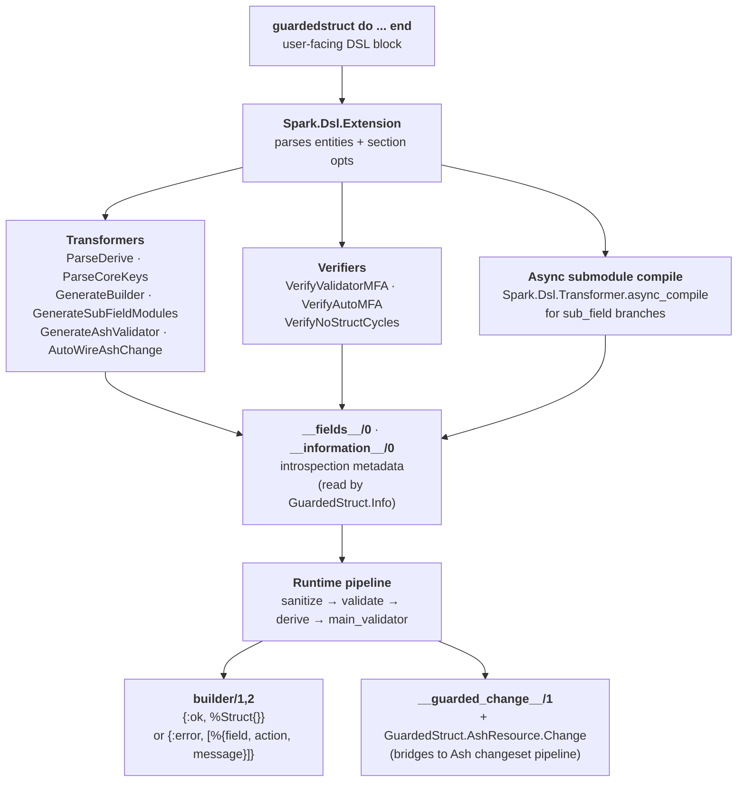

<div align="center">

# 🛡️ GuardedStruct

**Build Elixir structs with validation, sanitization, nested sub-structs, conditional fields, pattern-keyed maps, and a first-class Ash extension — declared once, parsed at compile time, validated on every build.** ✨

[](https://hex.pm/packages/guarded_struct)
[](https://hex.pm/packages/guarded_struct)
[](https://github.com/mishka-group/guarded_struct/blob/master/LICENSE)
[](https://github.com/sponsors/mishka-group)
[](https://www.buymeacoffee.com/mishkagroup)

</div>

---

> [!NOTE]
> **Status — `0.1.0-beta`.** v0.1.0 rewrites the macro core on [Spark](https://hex.pm/packages/spark). Every existing 0.0.x API keeps working unchanged. Track every change in [`CHANGELOG.md`](./CHANGELOG.md).

---

## 📖 Table of contents

- [Why GuardedStruct?](#-why-guardedstruct)
- [Highlights](#-highlights)
- [Installation](#-installation)
- [Quick start](#-quick-start)
  - [A struct](#-a-struct)
  - [Nested + conditional](#-nested--conditional)
  - [Custom validators / sanitizers](#-custom-validators--sanitizers)
  - [Ash integration](#-ash-integration)
- [Atomic mode (Ash)](#️-atomic-mode-ash)
- [Introspection](#-introspection)
- [Architecture](#-architecture)
- [Compatibility](#-compatibility)
- [Documentation](#-documentation)
- [Status & roadmap](#-status--roadmap)
- [Contributing](#-contributing)
- [Funding & sponsorship](#-funding--sponsorship)
- [License](#-license)

---

## 💭 Why GuardedStruct?

Defining a "good" struct in Elixir means doing the same boilerplate every time: `defstruct`, `@enforce_keys`, a `@type t()`, a constructor, per-field validation, sanitization, default values, nested structs, error messages, i18n. Each surface ends up subtly different across projects.

**GuardedStruct collapses that into a DSL.** One `guardedstruct do ... end` block declares fields, validation rules, sanitization, nested sub-structs, conditional dispatch, custom callbacks. The library generates `defstruct`, `@type t()`, a `builder/1,2` constructor, introspection functions, and a configurable error pipeline — all parsed once at compile time so the runtime hot path is small.

```elixir
defmodule User do
  use GuardedStruct

  guardedstruct do
    field :name,  :string, enforce: true,
      derives: "sanitize(trim, capitalize) validate(string, max_len=80)"

    field :email, :string, enforce: true,
      derives: "sanitize(trim, downcase) validate(email_r)"

    field :age, :integer,
      derives: "validate(integer, min_len=0, max_len=120)"

    field :role, :string, default: "user",
      derives: "validate(enum=String[admin::user::guest])"
  end
end

User.builder(%{
  name: "  alice  ",
  email: "ALICE@EXAMPLE.COM",
  age: 30
})
# => {:ok, %User{name: "Alice", email: "alice@example.com", age: 30, role: "user"}}

User.builder(%{name: "x", email: "bad", age: -5})
# => {:error, [
#      %{field: :email, action: :email_r, message: "..."},
#      %{field: :age,   action: :min_len, message: "..."}
#    ]}
```

That's the full surface. No `defstruct`, no `@enforce_keys`, no validator boilerplate, no constructor. 🚀

---

## ✨ Highlights

### 🏗️ Core DSL

- 🧱 **`field`** — typed, optionally enforced, with default, sanitize+validate derive, auto-fill MFA, per-field validator, cross-field `on:`/`from:`/`domain:`.
- 🌲 **`sub_field`** — recursive nested struct, any depth, generates real submodules with their own `builder/1`.
- 🎭 **`conditional_field`** — sum-type-like dispatch: same field name resolves to different shapes based on the input (string OR struct OR list). Nestable to arbitrary depth.
- 👻 **`virtual_field`** — validated through the full pipeline but excluded from `defstruct` (classic `password_confirm` use case).
- 🌀 **`dynamic_field`** — free-form map with passthrough; atom-attack-safe (string keys stay strings, no `String.to_atom` of attacker input).
- 🔣 **Pattern-keyed maps** — `field` whose name is a regex declares a map shape with no fixed keys; uniform per-value validation.
- 🧬 **Erlang Records** — `validate(record=tag)` accepts tagged tuples.

### 🧪 Derive mini-language

```elixir
field :slug, :string,
  derives: "sanitize(trim, downcase) validate(string, not_empty, max_len=80) sanitize(slugify)"
  
# OR

@derives "sanitize(trim, downcase) validate(string, not_empty, max_len=80) sanitize(slugify)"
field :slug, :string  
```

- 🧼 **Sanitize ops** — `trim`, `upcase`, `downcase`, `capitalize`, `strip_tags`, `basic_html`, `html5`, `tag`, plus user-defined custom ops.
- ✅ **Validate ops** — `string`, `integer`, `float`, `boolean`, `atom`, `list`, `map`, `tuple`, `record`, `not_empty`, `not_empty_string`, `max_len`, `min_len`, `max`, `min`, `equal`, `uuid`, `email`, `email_r`, `url`, `url_r`, `ipv4`, `ipv6`, `regex`, `enum`, `datetime`, `date`, `time`, `geo`, `location`, plus user-defined.
- 🎯 **All ops parsed at compile time** — runtime reads pre-built op-maps from `__fields__/0`; zero `Code.eval_string` on the hot path.
- 🧰 **`@derives` decorator** — alternative to inline `derives:` for keeping fields short.

### 🪝 Custom validators / sanitizers (`Derive.Extension`)

```elixir
defmodule MyApp.Derives do
  use GuardedStruct.Derive.Extension

  derives do
    validator :slug, fn input ->
      is_binary(input) and Regex.match?(~r/^[a-z0-9-]+$/, input)
    end

    sanitizer :slugify, fn input ->
      input |> String.downcase() |> String.replace(~r/[^a-z0-9]+/u, "-")
    end
  end
end
```

Register globally (`config :guarded_struct, derive_extensions: [MyApp.Derives]`) or per-module (`use GuardedStruct, derive_extensions: [MyApp.Derives]`). Per-module lists support a `:config` sentinel for in-position merge with the global registry. Compile-time shadow warnings if a custom op-name collides with a built-in.

### 🔌 Ash integration

```elixir
defmodule MyApp.User do
  use Ash.Resource, extensions: [GuardedStruct.AshResource]

  guardedstruct do
    auto_wire true
    field :email, :string, derives: "sanitize(trim, downcase) validate(email_r)"
  end

  attributes do
    uuid_primary_key :id
    attribute :email, :string, allow_nil?: false, public?: true
  end

  actions do
    defaults [:read, :destroy]
    create :create, accept: [:email]
  end
end
```

- 🌉 **`GuardedStruct.AshResource.Change`** — bridges `__guarded_change__/1` into the Ash changeset pipeline.
- ⚡ **`auto_wire true`** — Spark transformer injects the change for you; no `changes do ... end` block needed.
- 📦 **`batch_change/3`** — `Ash.bulk_create/3` and `Ash.bulk_update/3` (with `strategy: :stream`) work end-to-end.
- 🌊 **Auto-map cascade** — every `sub_field` returns a plain map at every depth (matches Ash's `:map` attribute type).
- ⚛️ **Atomic-safe by default** — `Change.atomic/3` runs the pipeline on plain literals and returns `{:atomic, sanitized_map}`; update actions stay atomic without `require_atomic? false`.

### 🔮 Standalone validation API

```elixir
GuardedStruct.Validate.run("validate(email_r)", "alice@x.io")
# => {:ok, "alice@x.io"}

GuardedStruct.Validate.field(User, :email, "bad")
# => {:error, [%{field: :email, action: :email_r, ...}]}

GuardedStruct.Validate.partial(User, %{name: "Alice"})
# => {:ok, %{name: "Alice"}}  # missing fields skipped, no enforce check
```

### 📡 Telemetry

Every top-level `builder/1` emits `[:guarded_struct, :builder, :start | :stop | :exception]`. Attach a handler for logging, metrics, tracing — no manual instrumentation needed.

### 🪞 Introspection (`GuardedStruct.Info`)

```elixir
GuardedStruct.Info.describe(User)
# => %{module: User, keys: [...], enforce_keys: [...],
#       fields: [%{name: :email, kind: :field, ...}, ...],
#       options: %{enforce: true, json: false, ...}}

GuardedStruct.Info.field_kind(User, :email)         #=> :field
GuardedStruct.Info.enforce?(User, :email)           #=> true
GuardedStruct.Info.sub_module(User, :address)       #=> User.Address
GuardedStruct.Info.conditional_children(User, :billing)
```

### 🛡️ Errors as Splode exceptions (opt-in)

```elixir
case User.builder(input) do
  {:ok, _} = ok -> ok
  {:error, errs} -> {:error, GuardedStruct.Errors.from_tuple(errs)}
end
```

Gives `Splode.traverse_errors/2`, `to_class/1`, JSON-serializable errors.

### 📤 JSON encoding (opt-in)

```elixir
guardedstruct json: true do
  field :id, :string
end
```

Auto-derives `Jason.Encoder` when `:jason` is in deps, falling back to the built-in `JSON.Encoder` on Elixir 1.18+. No-op if neither is present.

### 🌍 Cross-cutting

- 🌐 **i18n** — every error message resolves through `GuardedStruct.Messages`; override callbacks to translate.
- 🛡️ **Atom-attack safe** — `dynamic_field` and pattern-keyed maps never `String.to_atom` user input.
- 🧪 **Property-based tested** — 740+ tests including 6 property tests, real Ash integration suite with ETS data layer.

---

## 🚀 Installation

Add to your `mix.exs`:

```elixir
def deps do
  [
    {:guarded_struct, "~> 0.1.0"}
  ]
end
```

Fetch and compile:

```sh
mix deps.get
mix compile
```

Upgrading from `0.0.x`? Existing code keeps working unchanged — see [`CHANGELOG.md`](./CHANGELOG.md) for every change in v0.1.0.

### Optional deps

Pull in only what you need:

```elixir
{:jason, "~> 1.4"}            # for `json: true` (Elixir < 1.18, otherwise built-in JSON works)
{:splode, "~> 0.3"}           # for Errors wrapper
{:ash, "~> 3.0"}              # for the Ash extension
{:html_sanitize_ex, "~> 1.5"} # for `sanitize(strip_tags, basic_html, html5)`
{:email_checker, "~> 0.2"}    # for `validate(email)` (DNS lookup; non-atomic)
{:ex_url, "~> 2.0"}           # for `validate(url)` (DNS / port check; non-atomic)
```

---

## 🎯 Quick start

### 📐 A struct

```elixir
defmodule Order do
  use GuardedStruct

  guardedstruct enforce: true do
    field :id, :string, auto: {Ecto.UUID, :generate}
    field :total, :integer, derives: "validate(integer, min_len=0)"
    field :currency, :string, default: "USD",
      derives: "validate(enum=String[USD::EUR::GBP::JPY])"
    field :placed_at, :string, derives: "validate(datetime)"
  end
end

Order.builder(%{total: 9_900, placed_at: "2026-05-14T10:00:00Z"})
# => {:ok, %Order{id: "a-uuid", total: 9900, currency: "USD", placed_at: "..."}}
```

### 🌳 Nested + conditional

```elixir
defmodule Account do
  use GuardedStruct

  guardedstruct do
    field :name, :string, enforce: true

    sub_field :owner, struct(), enforce: true do
      field :email, :string, enforce: true, derives: "validate(email_r)"
      field :role, :string, default: "owner"
    end

    # Same field name resolves to either a string preset OR a detailed map
    conditional_field :plan, any() do
      field :plan, :string, hint: "preset",
        derives: "validate(enum=String[free::pro::enterprise])"

      sub_field :plan, struct() do
        field :tier, :string, enforce: true
        field :seats, :integer, derives: "validate(integer, min_len=1)"
      end
    end
  end
end

Account.builder(%{name: "Acme", owner: %{email: "z@a.io"}, plan: "pro"})
# => {:ok, %Account{plan: "pro", ...}}

Account.builder(%{name: "Acme", owner: %{email: "z@a.io"},
                  plan: %{tier: "custom", seats: 50}})
# => {:ok, %Account{plan: %Account.Plan1{tier: "custom", seats: 50}, ...}}
```

### 🪝 Custom validators / sanitizers

```elixir
defmodule MyApp.Derives do
  use GuardedStruct.Derive.Extension

  derives do
    validator :slug, fn input ->
      is_binary(input) and Regex.match?(~r/^[a-z0-9-]+$/, input)
    end

    sanitizer :slugify, fn input when is_binary(input) ->
      input
      |> String.downcase()
      |> String.replace(~r/[^a-z0-9]+/u, "-")
      |> String.trim("-")
    end

    validator :positive_int, fn n -> is_integer(n) and n > 0 end
  end
end

# Register globally:
# config :guarded_struct, derive_extensions: [MyApp.Derives]

defmodule Post do
  use GuardedStruct

  guardedstruct do
    field :slug, :string, derives: "sanitize(slugify) validate(slug)"
    field :views, :integer, derives: "validate(positive_int)"
  end
end
```

### 🔌 Ash integration

```elixir
defmodule MyApp.User do
  use Ash.Resource, extensions: [GuardedStruct.AshResource]

  guardedstruct do
    auto_wire true

    field :email, :string,
      derives: "sanitize(trim, downcase) validate(email_r, max_len=320)"

    field :nickname, :string,
      derives: "sanitize(trim) validate(string, max_len=20)"
  end

  attributes do
    uuid_primary_key :id
    attribute :email,    :string, allow_nil?: false, public?: true
    attribute :nickname, :string, public?: true
  end

  actions do
    defaults [:read, :destroy]
    create :create, accept: [:email, :nickname]

    update :update do
      accept [:email, :nickname]
    end
  end
end

MyApp.User
|> Ash.Changeset.for_create(:create, %{email: "  Alice@X.IO  "})
|> Ash.create()
# => {:ok, %MyApp.User{email: "alice@x.io", ...}}
```

---

## ⚛️ Atomic mode (Ash)

`GuardedStruct.AshResource.Change` is atomic-safe by default. There's no flag to flip and no `require_atomic? false` to add — update and destroy actions run as single-statement SQL with sanitized values.

```elixir
guardedstruct do
  auto_wire true

  field :email,    :string,  derives: "sanitize(trim, downcase) validate(email_r, max_len=320)"
  field :age,      :integer, derives: "validate(integer, min_len=0, max_len=150)"
  field :role,     :string,  derives: "validate(enum=String[admin::user::guest])"
  field :tenant_id, :string, derives: "validate(uuid)"
end

# Update goes through atomic/3 — pipeline runs in Elixir on the plain
# literal input, sanitized value is substituted into the UPDATE SQL.
record
|> Ash.Changeset.for_update(:update, %{email: "  New@X.IO  "})
|> Ash.update()
# => {:ok, %{email: "new@x.io", ...}}
```

**How it works.** `Change.atomic/3` reads `changeset.attributes` and `changeset.atomics`, detects whether any atomic value is an `Ash.Expr`, and:

- if every value is a plain literal → runs the full `__guarded_change__/1` pipeline (sanitize → validate → derive → `auto:` → main_validator) and returns `{:atomic, sanitized_map}` for Ash to substitute into the SQL,
- if any value is an `Ash.Expr` (e.g. from `Ash.Changeset.atomic_update(record, :counter, expr(counter + 1))`) → returns `{:not_atomic, reason}` and Ash falls back to the imperative path. This is rare in practice; 99% of changesets pass plain values.

---

## 🪞 Introspection

```elixir
# Full dump in one call
GuardedStruct.Info.describe(MyApp.User)
# %{
#   module: MyApp.User,
#   path: [], key: :root, shape: :struct,
#   keys: [:email, :nickname], enforce_keys: [:email],
#   conditional_keys: [],
#   options: %{enforce: true, json: false, ...},
#   fields: [
#     %{name: :email, kind: :field, enforce?: true,
#       type: "String.t()", derive: "...", auto: nil, ...},
#     ...
#   ]
# }

# Field-level helpers
GuardedStruct.Info.field_kind(MyApp.User, :email)         #=> :field
GuardedStruct.Info.enforce?(MyApp.User, :email)           #=> true
GuardedStruct.Info.virtual?(MyApp.User, :password_confirm) #=> true
GuardedStruct.Info.field_derives(MyApp.User, :email)
#=> "sanitize(trim, downcase) validate(email_r)"

# Collections by kind
GuardedStruct.Info.sub_fields(MyApp.User)         #=> [:address]
GuardedStruct.Info.virtual_fields(MyApp.User)     #=> [:password_confirm]
GuardedStruct.Info.conditional_fields(MyApp.User) #=> [:plan]

# Navigation
GuardedStruct.Info.sub_module(MyApp.User, :address)
#=> MyApp.User.Address
GuardedStruct.Info.conditional_children(MyApp.User, :plan)
#=> [%{kind: :field, ...}, %{kind: :sub_field, ...}]
```

---

## 🏗️ Architecture



- 🧠 **DSL layer** — Spark sections + entities define `field`, `sub_field`, `conditional_field`, `virtual_field`, `dynamic_field`. Every op-string parsed at compile time.
- 🔧 **Transformers** — codegen for `defstruct`/`builder`/`keys`/`__information__`/`__fields__`, async sub_field submodule generation, derive parsing, core-key parsing, Ash-variant codegen, auto-wire injection.
- 🔍 **Verifiers** — validator MFAs exist, auto MFAs exist, no struct cycles.
- 🏃 **Runtime** — receives a map, walks pre-parsed op-lists per field, hands back `{:ok, %Struct{}}` or `{:error, [%{field, action, message}]}`. The Ash bridge routes the same pipeline through `__guarded_change__/1` into changeset attributes.

---

## 🔌 Compatibility

| Dependency | Required version | Required? |
|---|---|---|
| Elixir | `~> 1.17` | ✅ |
| Spark | `~> 2.7` | ✅ |
| Splode | `~> 0.3` | ✅ (errors module) |
| Telemetry | `~> 1.0` | ✅ |
| html_sanitize_ex | `~> 1.5` | ⚪ optional (`sanitize(strip_tags/basic_html/html5)`) |
| Jason | `~> 1.4` | ⚪ optional (`json: true` on Elixir < 1.18) |
| email_checker | `~> 0.2` | ⚪ optional (`validate(email)` with DNS) |
| ex_url | `~> 2.0` | ⚪ optional (`validate(url)` with DNS) |
| Ash | `~> 3.0` | ⚪ optional (for the `Ash.Resource` extension) |

---

## 📚 Documentation

- 📖 **API docs** — [hexdocs.pm/guarded_struct](https://hexdocs.pm/guarded_struct)
- 📘 **LiveBook walkthrough** — [`guidance/guarded-struct.livemd`](./guidance/guarded-struct.livemd) — runnable end-to-end examples
- 📜 **Changelog** — [`CHANGELOG.md`](./CHANGELOG.md)
- 🔐 **Security policy** — [`SECURITY.md`](./SECURITY.md) — supported versions + how to report a vulnerability
- 🧱 **DSL reference** — auto-generated cheat sheets in `documentation/dsls/` (published to hexdocs)
- 📰 **Blog post** — [Consolidating Input and Output Validation and Sanitization in Elixir with GuardedStruct library](https://mishka.tools/blog/guardedstruct-advanced-elixir-struct-data-validation-and-sanitization)

---

## 🛣️ Status & roadmap

| Area | Status |
|---|---|
| `0.1.0` rewrite on Spark | 🟢 Shipped |
| Backward compatibility with `0.0.x` | 🟢 Drop-in — every 0.0.x API preserved |
| Nested `conditional_field` (closes #7, #8, #25) | 🟢 Shipped |
| Pattern-keyed maps (closes #11) | 🟢 Shipped |
| `virtual_field` / `dynamic_field` (closes #5) | 🟢 Shipped |
| Standalone `Validate` API (closes #2) | 🟢 Shipped |
| Erlang Records (closes #6) | 🟢 Shipped |
| Custom validators via Spark DSL | 🟢 Shipped |
| Ash extension + auto-wire + atomic mode | 🟢 Shipped |
| Test coverage | 🟢 743+ tests, real Ash integration suite |
| `1.0.0` release | 🟢 Shipped |

Breaking changes will be flagged in the [CHANGELOG](./CHANGELOG.md).

---

## 🤝 Contributing

Issues, PRs, and design discussions are welcome. 💬

```sh
git clone https://github.com/mishka-group/guarded_struct.git
cd guarded_struct
mix deps.get
mix test
```

Before opening a PR:

- ✅ `mix test` — full suite green (`mix test --max-failures 1` for fail-fast)
- ✅ `mix lint` — `spark.formatter` + `format` both pass
- ✅ `mix cheat` — regenerate DSL cheat sheets if you touched entities

For larger feature work, please open an issue first so we can align on the design.

---

## 💖 Funding & sponsorship

GuardedStruct is open-source software developed by [Mishka Group](https://github.com/mishka-group). If your team or company benefits from this work, please consider supporting continued development:

<div align="center">

[](https://github.com/sponsors/mishka-group)
&nbsp;&nbsp;&nbsp;
[](https://www.buymeacoffee.com/mishkagroup)

**☕ Donate / sponsor:**
[github.com/sponsors/mishka-group](https://github.com/sponsors/mishka-group) · [buymeacoffee.com/mishkagroup](https://www.buymeacoffee.com/mishkagroup)

</div>

Sponsorship directly funds maintenance, new features, and documentation. Thank you. 💚

---

## 📜 License

Apache License 2.0 — see [`LICENSE`](LICENSE).

Copyright © [Mishka Group](https://mishka.tools) and contributors.
